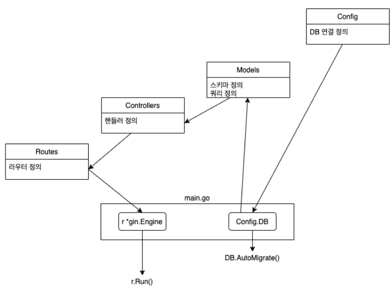

**목차**

- [1. 요약](#1-요약)
- [2. 목표](#2-목표)
- [3. API 목록](#3-api-목록)
- [4. 프로젝트 구조](#4-프로젝트-구조)
- [5. 패키지 별 기능과 관계](#5-패키지-별-기능과-관계)
- [6. 사전 작업](#6-사전-작업)
	- [6.1. DB, Table 생성](#61-db-table-생성)
	- [6.2. 모듈 생성](#62-모듈-생성)
	- [6.3. 패키지 다운로드](#63-패키지-다운로드)
- [7. Gin 작성](#7-gin-작성)
	- [7.1. 데이터베이스 설정](#71-데이터베이스-설정)
	- [7.2. 테이블, 스키마 정의](#72-테이블-스키마-정의)
	- [7.3. 라우트와 API 목록 설정](#73-라우트와-api-목록-설정)
	- [7.4. 데이터베이스 쿼리 작성](#74-데이터베이스-쿼리-작성)
	- [7.5. 핸들러 작성](#75-핸들러-작성)
	- [7.6. 메인함수 작성](#76-메인함수-작성)
- [8. 서버 구동 및 테스트](#8-서버-구동-및-테스트)
	- [8.1. 서버 구동](#81-서버-구동)
	- [8.2. API 호출 테스트](#82-api-호출-테스트)

**참고**

- [[Medium] Golang: A Todo App using GIN](https://medium.com/@_ektagarg/golang-a-todo-app-using-gin-980ebb7853c8)

---

# 1. 요약

- gin 을 사용해 간단한 RESTful API 를 구현함.
- 프로젝트 구조는 database 연결, 모델/스키마, 쿼리, 핸들러, 라우터, 메인함수로 정의함.
- 데이터베이스는 mysql 을 사용함. 디비 연결정보와 테이블 스키마는 구조체로 정의하고 GORM 을 사용해 디비에 연결하여 쿼리를 작성함.
- 핸들러에서 경로 파라미터, 앞서 작성한 쿼리들과 바인딩, Abort 로 예외처리를 사용함.
- gin 의 Group() 메서드를 활용해 URL 을 묶어서 관리함.

# 2. 목표

golang 의 웹 프레임워크 gin 을 이용해 TODO List 애플리케이션에 대한 RESTful API 구현을 해보자.

# 3. API 목록

```bash
GET: /v1/todo 
POST: /v1/todo
GET: /v1/todo/:id
PUT: /v1/todo/:id
DELETE: /v1/todo/:id
```

# 4. 프로젝트 구조

```bash
.
├── Config
│   └── Database.go
├── Controllers
│   └── Todo.go
├── Models
│   └── Model.go
│   └── Todos.go
├── Routes
│   └── Routes.go
├── go.mod
├── go.sum
└── main.go
```

- Config/Database.go : 데이터베이스 설정 및 연결
- Controllers/Todo.go : 비즈니스 로직을 위한 핸들러 정의
- Models/Model.go : 테이블, 스키마 정의
- Models/Todos.go :  todo 테이블에 대한 쿼리들 정의
- Routes/Routes.go : 라우터 정의
- go.mod, go.sum : 패키지 관리
- main.go : 메인 파일

# 5. 패키지 별 기능과 관계



# 6. 사전 작업

## 6.1. DB, Table 생성

mysql 서버를 도커 컨테이너로 구동

```bash
MYSQL_CON_NAME="gin-todo-mysql"
MYSQL_HOST_PORT=3306
MYSQL_HOST_VOLUME="$PWD/mysql"
MYSQL_ROOT_PASSWORD="mypassword"
MYSQL_TAG="8.0.22"

echo $MYSQL_CON_NAME
echo $MYSQL_HOST_PORT
echo $MYSQL_HOST_VOLUME
echo $MYSQL_ROOT_PASSWORD
echo $MYSQL_TAG

docker run -d \
  --name $MYSQL_CON_NAME \
  -v $MYSQL_HOST_VOLUME:/var/lib/mysql \
  -p $MYSQL_HOST_PORT:3306 \
  -e MYSQL_ROOT_PASSWORD=$MYSQL_ROOT_PASSWORD \
  mysql:$MYSQL_TAG
```

데이터베이스 생성 및 확인

```bash
mysql> CREATE DATABASE todos DEFAULT CHARACTER SET UTF8;
Query OK, 1 row affected, 1 warning (0.01 sec)

mysql> SHOW DATABASES;
+--------------------+
| Database           |
+--------------------+
| information_schema |
| mysql              |
| performance_schema |
| sys                |
| todos              |
+--------------------+
5 rows in set (0.00 sec)
```

테이블 생성 및 확인

```bash
mysql> USE todos;
Database changed

mysql> SHOW TABLES;
Empty set (0.00 sec)

mysql> CREATE TABLE todos
       (
       id INT NOT NULL AUTO_INCREMENT,
       title VARCHAR(32),
       description VARCHAR(32),
           PRIMARY KEY(ID)
       );
Query OK, 0 rows affected (0.03 sec)
```

- 칼럼명이 구조체에서 정의한 `json:<칼럼명>` 과 다르면 문제가 발생함.

## 6.2. 모듈 생성

```bash
mkdir todo && cd $_
go mod init github.com/bellship24/easy-todo
```

- 모듈 이름은 알맞게 수정해서 사용하면 됨.

## 6.3. 패키지 다운로드

```bash
go get github.com/go-sql-driver/mysql
go get github.com/gin-gonic/gin
go get github.com/jinzhu/gorm
```

# 7. Gin 작성

## 7.1. 데이터베이스 설정

`Config/Database.go`

```bash
package Config

import (
	"fmt"

	"github.com/jinzhu/gorm"
)

var DB *gorm.DB

// DBConfig represents db configuration
type DBConfig struct {
	Host     string
	Port     int
	User     string
	DBName   string
	Password string
}

func BuildDBConfig() *DBConfig {
	dbConfig := DBConfig{
		Host:     "0.0.0.0",
		Port:     3306,
		User:     "root",
		DBName:   "todos",
		Password: "mypassword",
	}
	return &dbConfig
}

func DbURL(dbConfig *DBConfig) string {
	return fmt.Sprintf(
		"%s:%s@tcp(%s:%d)/%s?charset=utf8&parseTime=True&loc=Local",
		dbConfig.User,
		dbConfig.Password,
		dbConfig.Host,
		dbConfig.Port,
		dbConfig.DBName,
	)
}
```

- ORM 으로 GORM 을 사용함.
- *gorm.DB 로 DB 객체를 선언함. 추후에 DB 에 쿼리할 때 사용함.
- DBConfig{} 구조체를 정의함. DB 접근 관련 정보가 있음. IP, Port, 계정 정보, 데이터베이스 명이 있음.
- BuildDBConfig() 함수를 정의함. DBConfig 구조체를 활용해 접근할 DB 에 대해 명시하고 리턴함.
- DbURL() 함수를 정의함. *DBConfig 를 인수로 받아 이 구조체의 정보를 출력하여 접근할 DB 정보를 알 수 있음. 이 정보는 main.go 에서 사용할 gorm.Open() 의 두번째 인수로 활용될 수 있게 포맷팅한 문자열임.

## 7.2. 테이블, 스키마 정의

`Models/Model.go`

```go
package Models

type Todo struct {
	ID          uint   `json:"id"`
	Title       string `json:"title"`
	Description string `json:"description"`
}

func (b *Todo) TableName() string {
	return "todos"
}
```

- 이 프로젝트에서 `todos` 라는 테이블 하나만 사용함. 이 테이블은 속성으로 id, title, description 을 갖고 있음.
- 칼럼명이 구조체에서 정의한 `json:<칼럼명>` 과 다르면 문제가 발생함.
- TableName() 함수를 정의함. Todo 구조체 객체가 실제 데이터베이스에 접근할 때 사용하는 테이블의 이름을 나타냄.

## 7.3. 라우트와 API 목록 설정

- `gin.Default()` 는 Logger(로그를 gin.DefaultWriter에 기록) 와 Recovery 미들웨어가 이미 연결된 gin.Engine 인스턴스를 반환함.
- 반면에, 미들웨어가 연결된 빈 gin.Engine 인스턴스를 시작해야 하는 경우 `gin.New()` 를 사용함.
- gin 인스턴스의 `Group(){}` 을 사용하면 routes 를 여러개 사용 가능함.

`Routes/Routes.go`

```go
package Routes

import (
	"github.com/bellship24/gin-easy-todo/Controllers"
	"github.com/gin-gonic/gin"
)

func SetupRouter() *gin.Engine {
	r := gin.Default()
	v1 := r.Group("/v1")
	{
		v1.GET("todo", Controllers.GetTodos)
		v1.POST("todo", Controllers.CreateATodo)
		v1.GET("todo/:id", Controllers.GetATodo)
		v1.PUT("todo/:id", Controllers.UpdateATodo)
		v1.DELETE("todo/:id", Controllers.DeleteATodo)
	}

	return r
}
```

- gin 엔진 인스턴스를 `/v1` 경로에 대해 Group() 메서드로 묶어 v1 변수에 할당함.
- v1 인스턴스에 대해 CRUD 메서드를 사용해 첫번째 인자로 URL 경로를 넣고 두번째 인자로 핸들러 함수를 넣음.
- 핸들러 함수는 `Controllers/Todo.go` 에 정의했음.

## 7.4. 데이터베이스 쿼리 작성

`Models/Todos.go`

```go
package Models

import (
	"fmt"

	"github.com/bellship24/gin-easy-todo/Config"
	_ "github.com/go-sql-driver/mysql"
)

// fetch all todos at once
func GetAllTodos(todo *[]Todo) (err error) {
	if err = Config.DB.Find(todo).Error; err != nil {
		return err
	}
	return nil
}

// insert a todo
func CreateATodo(todo *Todo) (err error) {
	if err := Config.DB.Create(todo).Error; err != nil {
		return err
	}
	return nil
}

// fetch one todo
func GetATodo(todo *Todo, id string) (err error) {
	if err := Config.DB.Where("id = ?", id).First(todo).Error; err != nil {
		return err
	}
	return nil
}

// update a todo
func UpdateATodo(todo *Todo, id string) (err error) {
	fmt.Println(todo)
	Config.DB.Save(todo)
	return nil
}

// delete a todo
func DeleteATodo(todo *Todo, id string) (err error) {
	Config.DB.Where("id = ?", id).Delete(todo)
	return nil
}
```

- 테이블 todo 에서 모든 레코드 가져오기, 레코드 삽입, 특정 레코드 가져오기, 기존 레코드 업데이트, 레코드 삭제를 포함하는 API 를 생성하는 데 필요한 모든 데이터베이스 쿼리를 작성.
- gorm 의 쿼리 관련 메서드들은 *DB 를 반환함. 즉, 리턴하기 전에 인자로 받은 DB 객체 포인터에 대해 데이터를 업데이트함. 그러므로 쿼리 함수를 만들 때 반환값이 필요 없다면 .Error 로 에러만 리턴해서 예외 처리하고 에러만 반환하면 됨. 그게 위에 작성한 쿼리 함수들의 구조임.
- Find(*구조체) : SELECT * FROM 테이블명;
- Create(*구조체) :* INSERT INTO 테이블명 (칼럼들) VALUES (*구조체);
- Where(”필드명 = ?”, 값).First(*구조체) : SELECT * FROM 테이블명 WHERE 필드명 = 값 LIMIT 1;
    - where 메서드의 인자를 평무으로 작성해도 됨
- Save(*구조체) : UPDATE 테이블명 SET 칼럼=값... WHERE id=..;
- Delete(*구조체) : DELETE FROM 테이블명 WHERE id=<id>;

## 7.5. 핸들러 작성

- GIN은 request body 를 JSON, XML, YAML 등의 형식으로 바인딩하는 메서드(Must bind, Should bind)를 제공함.
- 그래서, 여기서는 request body 를 Models.Todo 에 바인딩함.
- 예를 들면, `c.BindJSON(&todo)` 같이 사용함. 즉, JSON 으로부터 `json:”fieldname”` 으로 바인딩함.
- 바인딩이란 프로그램에서 사용된 구성 요소의 실제 값 또는 프로퍼티를 결정짓는 행위를 의미함.
- `Models.Todo` 는 앞서 `Models/Model.go` 에서 정의한 `Todo` 구조체를 말함.
- 즉, 쉽게 말해, request body 를 todo 구조체에 바인딩하여 DB 의 todo 테이블과 상호작용 하기 위함. 여기서 상호 작용은 DB 에 쿼리하는 것이며 앞서 `Models/Todos.go` 에서 함수로 정의했던 것들이며 이 함수들의 인수로 `Todo` 구조체의 인스턴스가 사용됨.

`Controllers/Todo.go`

```go
package Controllers

import (
	"net/http"

	"github.com/bellship24/gin-easy-todo/Models"

	"github.com/gin-gonic/gin"
)

// List all todos
func GetTodos(c *gin.Context) {
	var todo []Models.Todo
	err := Models.GetAllTodos(&todo)
	if err != nil {
		c.AbortWithStatus(http.StatusNotFound)
	} else {
		c.JSON(http.StatusOK, todo)
	}
}

// Create a Todo
func CreateATodo(c *gin.Context) {
	var todo Models.Todo
	c.BindJSON(&todo)
	err := Models.CreateATodo(&todo)
	if err != nil {
		c.AbortWithStatus(http.StatusNotFound)
	} else {
		c.JSON(http.StatusOK, todo)
	}
}

// Get a particular Todo with id
func GetATodo(c *gin.Context) {
	id := c.Params.ByName("id")
	var todo Models.Todo
	err := Models.GetATodo(&todo, id)
	if err != nil {
		c.AbortWithStatus(http.StatusNotFound)
	} else {
		c.JSON(http.StatusOK, todo)
	}
}

// Update an existing Todo
func UpdateATodo(c *gin.Context) {
	var todo Models.Todo
	id := c.Params.ByName("id")
	err := Models.GetATodo(&todo, id)
	if err != nil {
		c.JSON(http.StatusNotFound, todo)
	}
	c.BindJSON(&todo)
	err = Models.UpdateATodo(&todo, id)
	if err != nil {
		c.AbortWithStatus(http.StatusNotFound)
	} else {
		c.JSON(http.StatusOK, todo)
	}
}

// Delete a Todo
func DeleteATodo(c *gin.Context) {
	var todo Models.Todo
	id := c.Params.ByName("id")
	err := Models.DeleteATodo(&todo, id)
	if err != nil {
		c.AbortWithStatus(http.StatusNotFound)
	} else {
		c.JSON(http.StatusOK, gin.H{"id:" + id: "deleted"})
	}
}
```

- 라우트 핸들러 함수들은 gin.Context 에 대한 포인터를 인수로 갖음. 이 컨텍스트는 핸들러가 필요로 하는 요청에 대한 모든 정보를 갖고 있음. 예를 들어, 요청 헤더, 요청 바디, 쿠키 등을 갖고 있음.
- 또한 컨텍스트는 HTML, text, JSON, XML 포맷으로 응답을 렌더하기 위해 사용되기도 함. 그 외에도 미들웨어 간에 변수를 주고 받거나 flow 를 관리할 수 있음.
- c.Params 는 라우터에서 반환된 Param 타입의 슬라이스임. 이 슬라이스는 정렬되어 있고 첫 번째 요소는 첫번째 URL 을 의미함(?). Param 타입은 key, value 로 구성된 단일 URL 파라미터임.
    
    ```go
    type Param struct {
    	Key   string
    	Value string
    }
    ```
    
    ```go
    type Params []Param
    ```
    
- c.Params.ByName() 은 주어진 인수와 일치하는 key 중에 첫번째 Param 의 값을 반환함. 일치하는 key 가 없다면, 빈 string 를 반환함.
- c.AbortWithStatus() 는 에러 처리 로직에서 Abort() 함수를 호출하고 net/http 패키지를 사용해 에러 코드 StatusNotFound 를 반환하는데 사용할 수 있음.
- Abort() 메서드는 pending 중인 핸들러가 호출되는 것을 방지함. 현재 핸들러를 중지하지는 않음. 예를 들어, 현재 요청이 권한 승인되었는지 확인하는 authorization 미들웨어가 있다고 가정해 보자. 인증이 실패하면(예: 비밀번호가 일치하지 않음) Abort 를 호출하여 이 요청에 대한 나머지 핸들러가 호출되지 않도록 함.
    
    ```go
    func (c *Context) Abort()
    ```
    
- c.JSON() 은 주어진 구조체를 JSON 으로 response body 에 직렬화serialize  함. 또한 Content-Type 을 "application/json" 으로 설정함.
    
    ```go
    func (c *Context) JSON(code int, obj interface{})
    ```
    
- gin.H{} 는 c.JSON 의 두번째 인수 obj interface{} 로 사용될 수 있음. 즉, json 포맷을 넣어주는 곳이며 gin.H{} 는 아래와 같은데, 다시 말해, map[string]interface{} 의 단축어라고 할 수 있음.
    
    ```go
    type H map[string]interface{}
    ```
    

## 7.6. 메인함수 작성

- 이제, DB config, Models, Routes, APIs 를 main.go 에서 결합하자. gorm.Open() 을 사용해 DB connection 을 초기화하자.

`main.go`

```go
package main

import (
	"fmt"

	"github.com/bellship24/gin-easy-todo/Config"
	"github.com/bellship24/gin-easy-todo/Models"
	"github.com/bellship24/gin-easy-todo/Routes"
	"github.com/jinzhu/gorm"
)

var err error

func main() {

	// Creating a connection to the database
	Config.DB, err = gorm.Open("mysql", Config.DbURL((Config.BuildDBConfig())))

	if err != nil {
		fmt.Println("status: ", err)
	}

	defer Config.DB.Close()

	// run the migration: todo struct
	Config.DB.AutoMigrate(&Models.Todo{})

	// setup routes
	r := Routes.SetupRouter()

	// running
	r.Run()
}
```

- *gorm.DB 인 Config.DB 에 gorm.Open() 을 활용해 DB 접근한 인스턴스를 할당.
- 이 gorm.Open() 의 인자로는 첫번째, 두번째 가 들어감.
- defer 를 통해 메인 프로세스가 종료되기 전에 DB 연결을 끊게 함.
- AutoMigrate() 는 스키마를 자동으로 마이그레이션하여 스키마 업데이트를 최신 상태로 유지함.
- 앞서 정의한 Routes.SetUpRouter() 를 사용해 리턴값인 gin.Engine 을 r 변수에 할당하고 r.Run() 으로 gin 서버를 구동함.

# 8. 서버 구동 및 테스트

## 8.1. 서버 구동

```bash
$ go run main.go

[GIN-debug] [WARNING] Creating an Engine instance with the Logger and Recovery middleware already attached.

[GIN-debug] [WARNING] Running in "debug" mode. Switch to "release" mode in production.
 - using env:   export GIN_MODE=release
 - using code:  gin.SetMode(gin.ReleaseMode)

[GIN-debug] GET    /v1/todo                  --> github.com/bellship24/gin-easy-todo/Controllers.GetTodos (3 handlers)
[GIN-debug] POST   /v1/todo                  --> github.com/bellship24/gin-easy-todo/Controllers.CreateATodo (3 handlers)
[GIN-debug] GET    /v1/todo/:id              --> github.com/bellship24/gin-easy-todo/Controllers.GetATodo (3 handlers)
[GIN-debug] PUT    /v1/todo/:id              --> github.com/bellship24/gin-easy-todo/Controllers.UpdateATodo (3 handlers)
[GIN-debug] DELETE /v1/todo/:id              --> github.com/bellship24/gin-easy-todo/Controllers.DeleteATodo (3 handlers)
[GIN-debug] [WARNING] You trusted all proxies, this is NOT safe. We recommend you to set a value.
Please check https://pkg.go.dev/github.com/gin-gonic/gin#readme-don-t-trust-all-proxies for details.
[GIN-debug] Environment variable PORT is undefined. Using port :8080 by default
[GIN-debug] Listening and serving HTTP on :8080
```

## 8.2. API 호출 테스트

GetTodos 호출 시에 정상적으로 200 리턴하지만 아무 데이터가 없어 빈 Response 가 출력됨.


CreateATodo 를 통해 신규 데이터를 생성했음. 이 외에도 시도 2, 3 생성함.


다시, GetTodos 로 앞서 만든 3 개의 데이터가 응답된 것을 확인할 수 있음.


GetATodo 로 특정 id 에 대한 응답을 확인


UpdateATodo 로 특정 id 에 대해 데이터를 수정함


다시 id 2 에 대해 GetATodo 호출 해보면 변경된 데이터를 응답함


DeleteATodo 로 id 2 데이터를 삭제함.


다시 GetTodos 로 전체 데이터를 조회해보면 6번이 삭제되어 제외되고 7, 8 번이 응답되는 것을 확인.


데이터베이스에서 쿼리로 확인.

```bash
mysql> select * from todos;
+----+-----------+-------------+
| id | title     | description |
+----+-----------+-------------+
|  1 | my test 1 | test 1.     |
|  3 | my test 3 | test 3.     |
+----+-----------+-------------+
2 rows in set (0.00 sec)
```

이렇게 gin 프레임워크를 이용해 간단한 RESTful API 을 만들어 봤다.
